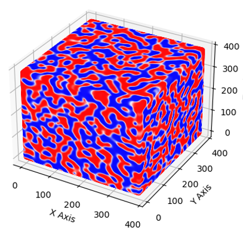

# Motivation:

This is a repo of solving phase field simulation benchmark problem with both CPU and GPU focusing on boosting the performance of code on a single computational unit with multiple ways. It is used for the data generation and performance comparision for the phase field benchmark problem with conventional numerical algorithms and machine learning algorithms. The results was published in this paper, https://iopscience.iop.org/article/10.1088/1361-651X/ad5f4a/meta. If you find the code is helpful or use it to generate phase field simulation data, please cite this paper. It is my last several publications before quiting acedamia. 

#
